# Educational Activity Management System

**EAMS User Manual**

This is a school activity management system for teachers, principals, and students. You can create activities, manage students, submit reports, review approvals, export PDF/Excel, and control public/private visibility.

Repository: [https://github.com/Wilson19-06/School-Activity](https://github.com/Wilson19-06/School-Activity)

---

## 1. How to Open the System

Local XAMPP URL:

```text
http://localhost/activity/login.php
```

After cloning this repository:

1. Copy the project into `htdocs/activity`
2. Create a MySQL database named `school_activity`
3. Confirm `config.php` matches your MySQL settings
4. Run `composer install`
5. Start Apache and MySQL, then open the URL above

---

## 2. Home / Login Page

Open the system and you will see four entry buttons.

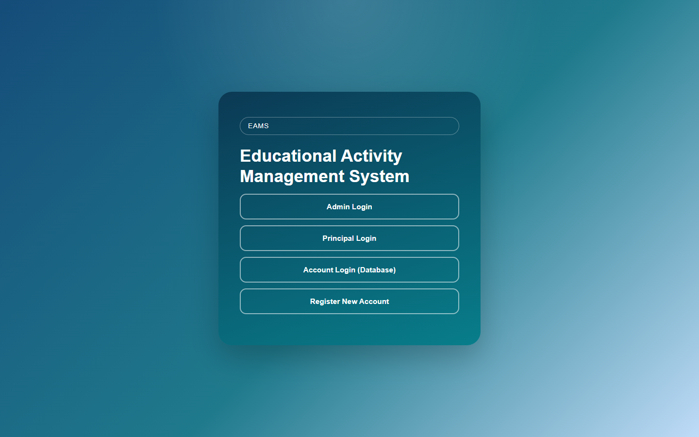

| Button | Who should use it |
| --- | --- |
| **Admin Login** | Quick teacher/admin login |
| **Principal Login** | Principal login |
| **Account Login (Database)** | Accounts created by Register or Manage Users |
| **Register New Account** | Create a new Teacher / Student / Principal account |

### Demo passwords

| Page | Username | Password |
| --- | --- | --- |
| Admin Login | (not required) | `admin123` |
| Principal Login | (not required) | `principal123` |
| Account Login | `ws` | `123` |

---

## 3. Admin Login

Click **Admin Login**. The password is already filled as `admin123`. Click **Login**.

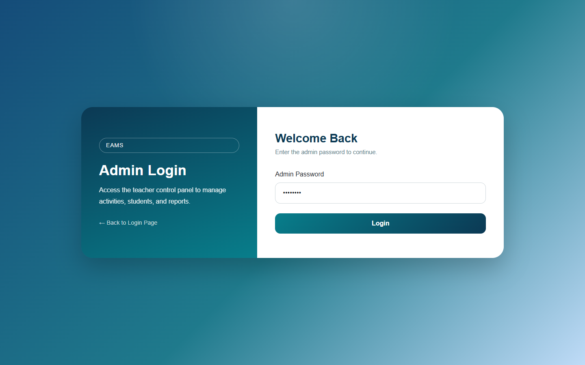

This login uses a fixed password and opens the teacher dashboard.

---

## 4. Principal Login

Click **Principal Login**. The password is already filled as `principal123`. Click **Login**.


This login opens the principal dashboard.

---

## 5. Account Login (Database)

Click **Account Login (Database)** to expand the form. Username `ws` and password `123` are pre-filled.

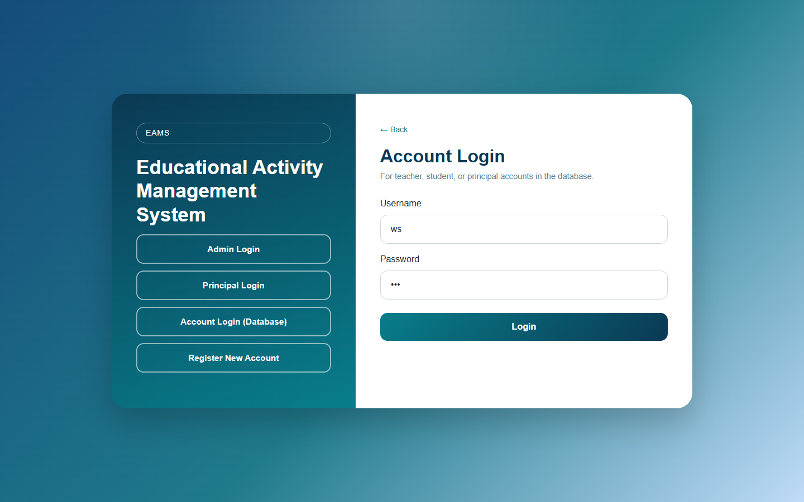

Use this for accounts stored in the database (teacher, student, or principal).

After login:

- **Principal** → Principal Dashboard
- **Student** → Student Dashboard
- **Teacher / Admin** → Teacher Dashboard

---

## 6. Register a New Account

Click **Register New Account**.

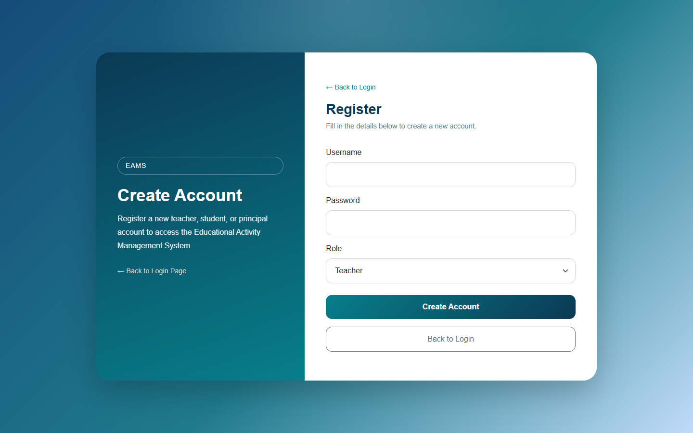

Steps:

1. Enter **Username** and **Password**
2. Choose **Role**: Teacher, Student, or Principal
3. Click **Create Account**
4. Use **Back to Login** to return to the login page

If the username already exists, the system will ask you to choose another one.

---

## 7. Teacher Dashboard

After teacher/admin login, you will see **Teacher Dashboard**.

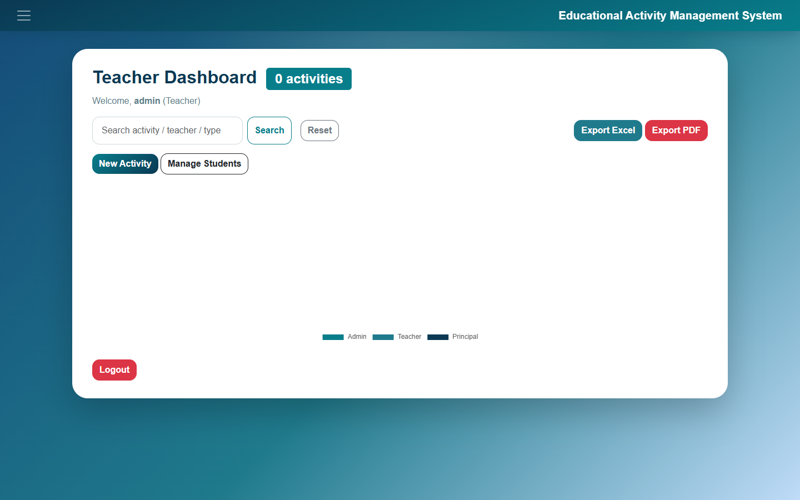

What you can do here:

- Search activities by name, teacher, or type
- Click **New Activity** to create an activity
- Click **Manage Students** to add/edit students
- Click **Export Excel** or **Export PDF**
- Open the top-left menu for Activity History, My Reports, Groups, and Facebook Template
- Click an activity card to view details
- Use **Edit** / **Delete** on a card (these buttons do not open the view page)

**Private activities:** if a principal sets an activity to **Private**, teachers cannot see it in the dashboard, history, view page, or exports.

---

## 8. Create an Activity

Menu → **Create Activity**, or click **New Activity** on the dashboard.

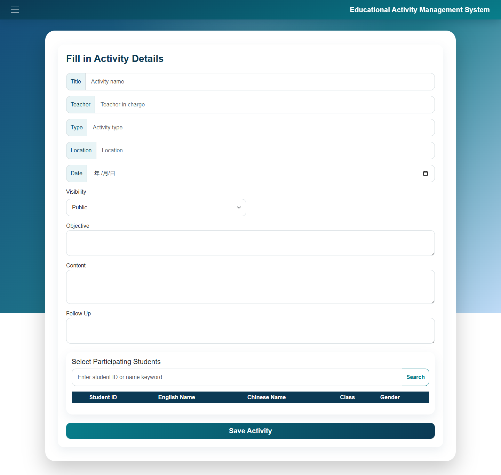

Fill in:

- Title, Teacher, Type, Location, Date
- **Visibility**: `Public` (everyone allowed can see) or `Private` (principal only, unless you created it yourself)
- Objective, Content, Follow Up
- Search and tick participating students
- Click **Save Activity**

---

## 9. Manage Students

Menu → **Manage Students**.

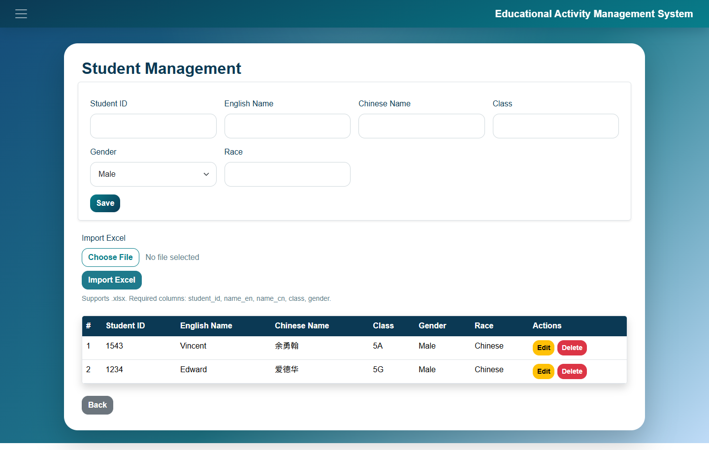

You can add, edit, and search students (Student ID, English name, Chinese name, class, gender).

---

## 10. Activity History

Menu → **Activity History**. This lists past activities (date before today).

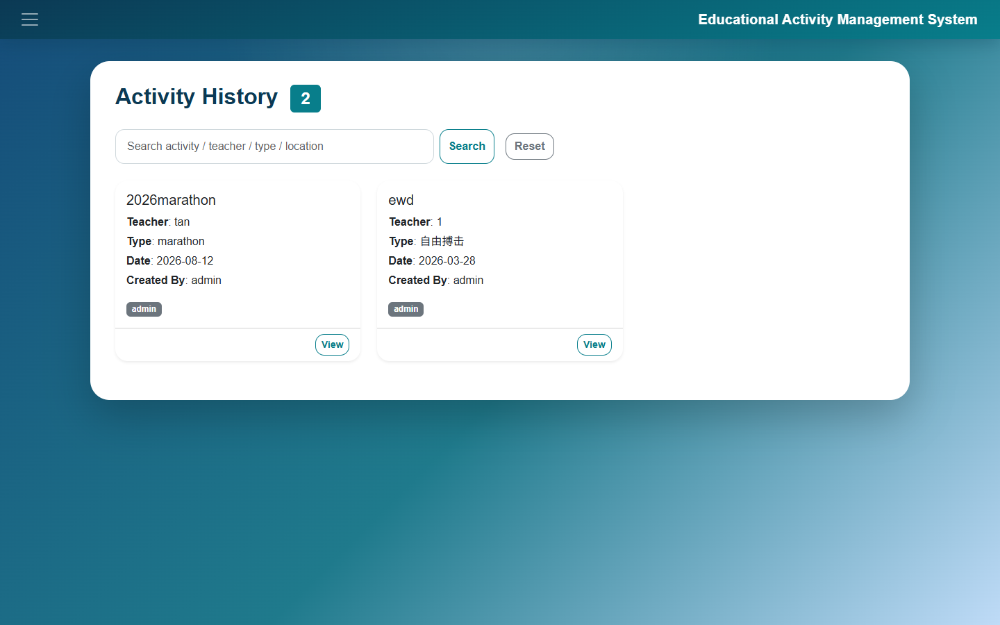

Use the search box to find an activity by name, teacher, type, location, or creator. Click **View** for details. Click **Reset** to clear the search.

---

## 11. Principal Dashboard

After principal login, you will see **Principal Dashboard**.

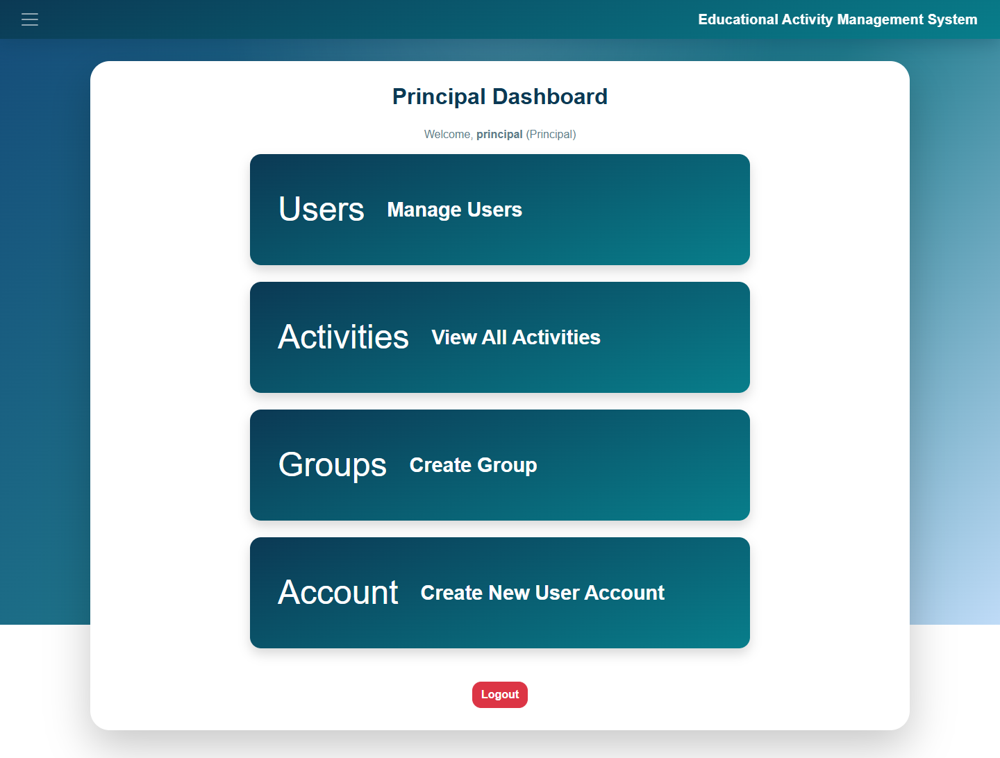

Main shortcuts:

- **Manage Users** — create teacher/principal accounts
- **View All Activities** — review, approve, hide/show, delete
- **Create Group** — create teacher groups
- **Create New User Account** — open Register

The top-left menu also has All Activities, Group List, Manage Students, Create Activity, Reports, History, and Facebook Template.

---

## 12. All Activities (Principal)

From the principal dashboard, click **View All Activities**.

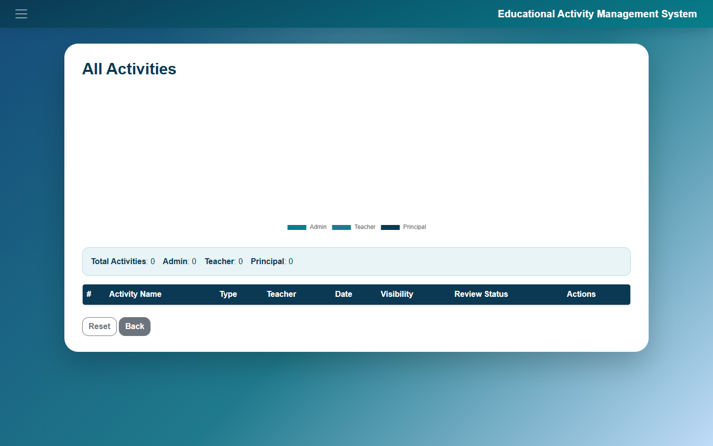

Here the principal can:

- See activity name, type, teacher, date, visibility, and review status
- Click the doughnut chart to filter by Admin / Teacher / Principal
- **Approve** / **Reject** principal-created activities
- Toggle **Public / Private**
- **View** activity details
- **Delete** an activity

Teachers cannot open this page. Private activities stay visible to the principal.

---

## 13. Manage Users (Principal)

From the principal dashboard, click **Manage Users**.

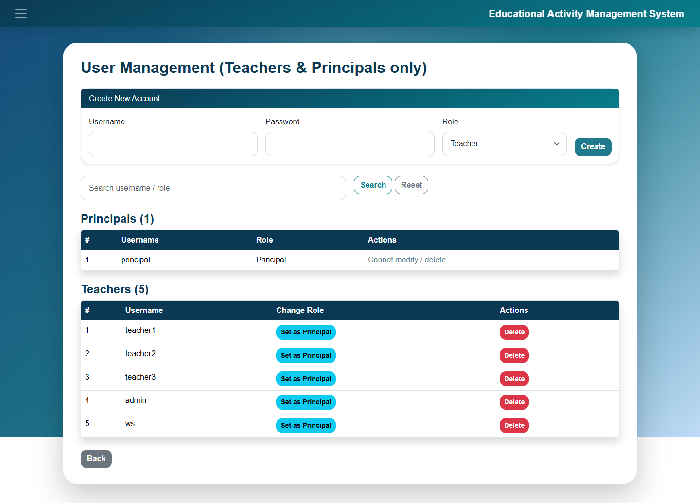

The principal can:

- Create a new Teacher or Principal account
- Search existing users
- Change a teacher to principal (where allowed)
- Delete a non-principal account

---

## 14. Roles and Visibility

| Role | Dashboard | Private activity |
| --- | --- | --- |
| Principal | Principal Dashboard | Can see all activities |
| Teacher | Teacher Dashboard | Cannot see principal Private activities |
| Student | Student Dashboard | Cannot see Private activities |

---

## 15. Export

On the teacher dashboard:

- **Export Excel** — download `.xlsx`
- **Export PDF** — download/view PDF (Chinese text uses Noto Sans)

On an activity details page you can also export that single activity.

---

## 16. Logout

Click **Logout** at the bottom of a dashboard, or open the top-left menu and choose **Logout**.
